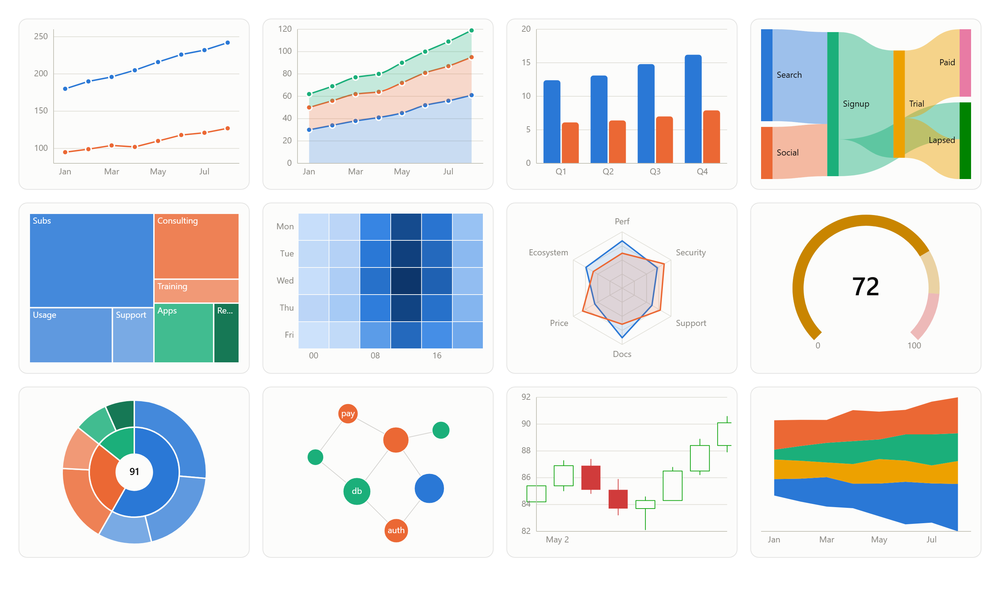

<div align="center">

# ChartCraft

**39 chart types. One accessible canvas engine. Zero runtime dependencies.**

A framework-agnostic TypeScript charting library with thin React, Vue, Svelte and
Angular wrappers — and accessibility built in, not bolted on.

[](https://www.npmjs.com/package/@chartcraft/core)
[](LICENSE)
[](https://www.typescriptlang.org/)
[](#why-chartcraft)
[](#the-39-chart-types)
[](#quality)
[](docs/accessibility.md)

[**Documentation**](https://sitharaj88.github.io/chartcraft/) ·
[**Live gallery**](https://sitharaj88.github.io/chartcraft/examples/) ·
[**Getting started**](https://sitharaj88.github.io/chartcraft/getting-started) ·
[**API reference**](https://sitharaj88.github.io/chartcraft/api/core)



</div>

---

## Install

```sh
npm install @chartcraft/core      # vanilla / any framework
npm install @chartcraft/react     # React 18+
npm install @chartcraft/vue       # Vue 3
npm install @chartcraft/svelte    # Svelte 4 & 5
npm install @chartcraft/angular   # Angular 20+
```

One package, not two: since v0.4 each wrapper re-exports core's complete public
surface — `lightTheme`, `categoricalPalette`, the scale classes,
`downsampleLTTB`, the decorator API — so `@chartcraft/core` does not need to be
a direct dependency. The re-exports are named, and verified to tree-shake:
importing `lightTheme` from a wrapper is byte-identical to importing it from
core.

## Quick start

```ts
import { createChart } from '@chartcraft/core';

const chart = createChart(document.querySelector<HTMLElement>('#chart')!, {
  type: 'line',
  title: 'Monthly revenue',
  data: {
    categories: ['Jan', 'Feb', 'Mar', 'Apr', 'May', 'Jun'],
    series: [
      { name: 'North', data: [42, 48, 51, 47, 60, 66] },
      { name: 'South', data: [30, 32, 29, 38, 41, 45] },
    ],
  },
});

chart.on('pointclick', (ev) => console.log(ev.seriesName, ev.x, ev.y));
chart.update({ title: 'Monthly revenue (USD k)' }); // diffed re-render
```

That is the whole thing. Axes are inferred from the data, the legend appears
because there are two series, and tooltips, keyboard navigation, the
screen-reader data table and dark-mode support are already on.

<details>
<summary><b>React</b></summary>

```tsx
import { LineChart } from '@chartcraft/react';

export function Revenue() {
  return (
    <LineChart
      title="Monthly revenue"
      data={{
        categories: ['Jan', 'Feb', 'Mar', 'Apr', 'May', 'Jun'],
        series: [{ name: 'North', data: [42, 48, 51, 47, 60, 66] }],
      }}
      onPointClick={(ev) => console.log(ev.seriesName, ev.x, ev.y)}
    />
  );
}
```
</details>

<details>
<summary><b>Vue 3</b></summary>

```vue
<script setup lang="ts">
import { LineChart } from '@chartcraft/vue';

const options = {
  title: 'Monthly revenue',
  data: {
    categories: ['Jan', 'Feb', 'Mar', 'Apr', 'May', 'Jun'],
    series: [{ name: 'North', data: [42, 48, 51, 47, 60, 66] }],
  },
};
</script>

<template>
  <LineChart :options="options" @point-click="(ev) => console.log(ev.seriesName)" />
</template>
```
</details>

<details>
<summary><b>Svelte</b></summary>

```svelte
<script>
  import { LineChart } from '@chartcraft/svelte';

  const options = {
    title: 'Monthly revenue',
    data: {
      categories: ['Jan', 'Feb', 'Mar', 'Apr', 'May', 'Jun'],
      series: [{ name: 'North', data: [42, 48, 51, 47, 60, 66] }],
    },
  };
</script>

<LineChart {options} on:pointclick={(e) => console.log(e.detail.seriesName)} />
```
</details>

<details>
<summary><b>Angular</b></summary>

```ts
import { Component, signal } from '@angular/core';
import { CcLineChart } from '@chartcraft/angular';
import type { PointEvent } from '@chartcraft/angular';

@Component({
  selector: 'app-revenue',
  imports: [CcLineChart],
  template: `<cc-line-chart [options]="options()" (pointClick)="onClick($event)" />`,
})
export class Revenue {
  readonly options = signal({
    title: 'Monthly revenue',
    data: {
      categories: ['Jan', 'Feb', 'Mar', 'Apr', 'May', 'Jun'],
      series: [{ name: 'North', data: [42, 48, 51, 47, 60, 66] }],
    },
  });

  onClick(ev: PointEvent) { console.log(ev); }
}
```

Standalone, signal-based and zoneless-ready — `zone.js` is neither a dependency
nor a peer dependency.
</details>

## Why ChartCraft

|  |  |
|---|---|
| **Zero runtime dependencies** | `@chartcraft/core` pulls in nothing. Canvas 2D behind a swappable `Renderer` interface. ESM + CJS + `.d.ts`. |
| **Accessible by default, not by configuration** | A canvas is one opaque rectangle to a screen reader, so every chart keeps a **parallel DOM layer**: `role="img"` summary, a real `<table>` of the data, full keyboard navigation, `aria-live` announcements, `prefers-reduced-motion` and genuine `forced-colors` support. On all 39 types. |
| **A palette that was validated, not chosen** | The 8-slot categorical palette is machine-checked for colorblind separation (adjacent-pair CVD ΔE ≥ 8) in **both** light and dark. Colour follows series *identity*, never rank — filtering never repaints the survivors. Past slot 8 the library adds a dash/marker channel rather than inventing a 9th hue. |
| **Real performance numbers** | 1M points redraw in **3.1 ms**; a 1M-point mount takes 1.21 s; `zoomTo` at 1M is 9.9 ms. LTTB downsampling re-runs *inside* the zoom window, so zooming into a million points reveals real detail. |
| **Exact parity across frameworks** | Wrappers own lifecycle, resize observation and event bridging — nothing else. Every feature lives in core, so no framework is a second-class citizen. |
| **Deterministic layouts** | No `Math.random()` anywhere: word clouds, circle packing, sankey ordering and force-directed graphs are seeded, so the same data always renders the same picture — and can be regression-tested. |

## The 39 chart types

| Family | Types |
|---|---|
| **Trends & comparison** | `line` · `area` · `bar` · `scatter` · `bubble` · `lollipop` · `slope` · `dumbbell` · `rangearea` |
| **Part-to-whole** | `pie` · `donut` · `funnel` · `pyramid` · `marimekko` · `streamgraph` |
| **Statistical** | `histogram` · `boxplot` · `violin` · `parallel` |
| **Financial & targets** | `candlestick` · `ohlc` · `waterfall` · `bullet` |
| **Hierarchy** | `treemap` · `sunburst` · `icicle` · `circlepack` |
| **Matrix & calendar** | `heatmap` · `calendar` |
| **Radial** | `radar` · `gauge` · `radialbar` · `rose` |
| **Flow & schedule** | `sankey` · `gantt` |
| **Geographic & graph** | `choropleth` · `network` |
| **Micro & text** | `sparkline` · `wordcloud` |

Plus **combo charts** — mix `line`, `bar`, `area` and `scatter` series in one
plot via a per-series `type`, always on a single shared y-axis.

Every type ships the full shared feature set — tooltip, legend policy, keyboard
navigation, data table, theming, animation, reduced motion, resize — and its own
[example page](https://sitharaj88.github.io/chartcraft/examples/) with an honest
*"when **not** to use this"* section.

## Features beyond chart types

| | |
|---|---|
| [Error bars](https://sitharaj88.github.io/chartcraft/features/error-bars) | Absolute or percentage, included in the value domain, tooltip and data table |
| [Trendlines](https://sitharaj88.github.io/chartcraft/features/trendlines) | Least squares, moving average, exponential — dashed and legend-labeled so a fit can never read as data |
| [Data labels](https://sitharaj88.github.io/chartcraft/features/data-labels) | With *measured* selectivity: `'auto'` drops labels that would collide |
| [Annotations](https://sitharaj88.github.io/chartcraft/features/annotations) | Reference lines, bands, labeled points, free text, plus an `annotationclick` event |
| [Zoom, pan & brush](https://sitharaj88.github.io/chartcraft/features/zoom-pan-brush) | Mouse **and** touch; downsampling re-runs inside the visible window |
| [Export](https://sitharaj88.github.io/chartcraft/features/export) | `exportImage()` (PNG at any scale) and `exportData()` (CSV/JSON mirroring the accessibility table exactly) |
| [Extensibility](https://sitharaj88.github.io/chartcraft/extensibility) | The decorator API the five features above are built on — public, documented, *experimental* |

## Quality

**2,114 tests** across five workspaces, strict TypeScript, and an adversarial
[quality audit](QUALITY-AUDIT.md) of all 39 types that deliberately tried to
refute the project's own claims — and succeeded on one, which was then fixed.
That report is kept in the repository, including its **"Coverage I do not have"**
section: no real-browser rendering, no screen-reader run, no visual regression
harness yet. Known divergences between the contract and the implementation live
in [DEVIATIONS.md](DEVIATIONS.md).

## Documentation

| | |
|---|---|
| [Getting started](https://sitharaj88.github.io/chartcraft/getting-started) | Install, first chart in every framework, updating, destroying |
| [Data model](https://sitharaj88.github.io/chartcraft/concepts/data-model) | Series, the `DataValue` shapes, null gaps, stable identity |
| [Scales & axes](https://sitharaj88.github.io/chartcraft/concepts/scales-and-axes) | Axis types, inference, ticks, log & time handling |
| [Theming](https://sitharaj88.github.io/chartcraft/concepts/theming) | Light/dark/auto, the validated palette, custom themes |
| [Interactions](https://sitharaj88.github.io/chartcraft/concepts/interactions) | Tooltips, legend toggling, touch, the events API |
| [Accessibility](https://sitharaj88.github.io/chartcraft/accessibility) | The parallel DOM strategy, keyboard map, WCAG 2.2 mapping |
| [Performance](https://sitharaj88.github.io/chartcraft/performance) | Downsampling, update vs recreate, large-data tips |
| [React](https://sitharaj88.github.io/chartcraft/frameworks/react) · [Vue](https://sitharaj88.github.io/chartcraft/frameworks/vue) · [Svelte](https://sitharaj88.github.io/chartcraft/frameworks/svelte) · [Angular](https://sitharaj88.github.io/chartcraft/frameworks/angular) | Per-framework guides |
| [API reference](https://sitharaj88.github.io/chartcraft/api/core) | Complete `@chartcraft/core` reference |
| [Roadmap](https://sitharaj88.github.io/chartcraft/roadmap) | SVG/WebGL renderers, Solid, SSR rendering, streaming data |

## Developing in this monorepo

npm workspaces; packages live under `packages/`.

```sh
npm install        # install all workspace dependencies
npm run build      # core + wrappers (tsup; Angular via ng-packagr → APF)
npm test           # vitest across all packages
npm run docs:dev   # docs site (VitePress) with live chart demos
npm run docs:build # static docs site → docs/.vitepress/dist
```

CI and the docs deploy are **manual only** — start them from the Actions tab, or:

```sh
gh workflow run ci.yml --ref main            # build, typecheck, test (Node 18/20/22)
gh workflow run deploy-docs.yml --ref main   # build and publish the docs site
```

`deploy-docs` provisions the GitHub Pages site itself (`configure-pages` with
`enablement: true`), and the base path is derived from the repository name.
To restore automatic runs, put the `push:` trigger back at the top of each
workflow.

The public API surface is defined by
[`docs/api-contract.md`](docs/api-contract.md) — core implements it, wrappers
consume it, docs document it. See [CONTRIBUTING.md](CONTRIBUTING.md) for the
contract-first workflow.

## Author

Built by **Sitharaj** —
[website](https://sitharaj.in) ·
[GitHub](https://github.com/sitharaj88) ·
[LinkedIn](https://www.linkedin.com/in/sitharaj08) ·
[buy me a coffee](https://www.buymeacoffee.com/sitharaj88)

## License

MIT © ChartCraft contributors. See [LICENSE](LICENSE).
